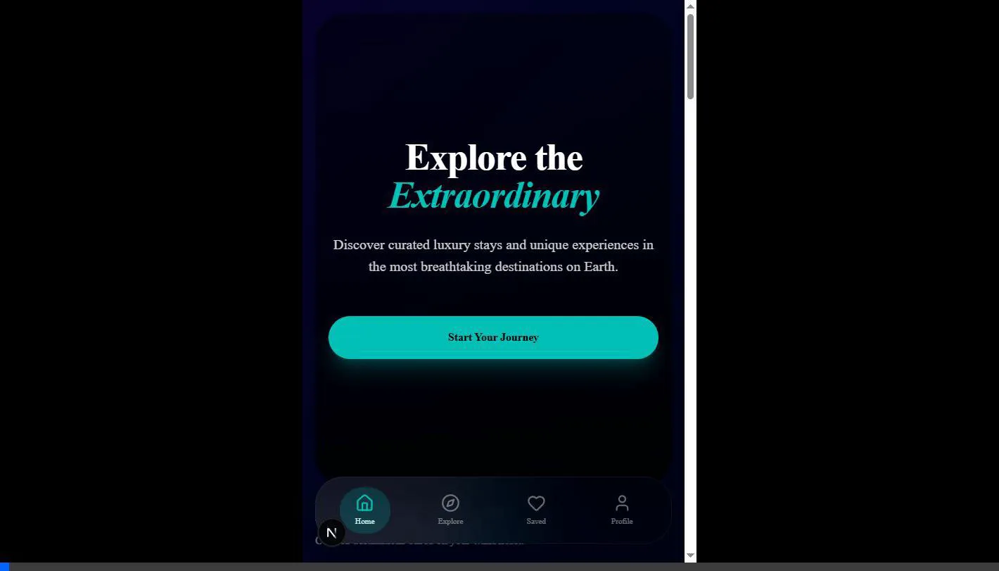

# Zenith | Extraordinary Travel

Zenith is a high-end travel discovery and booking application designed for a seamless experience across web and mobile platforms. Built with a "Midnight" aesthetic, it combines cinematic visuals with a native-like mobile interface.



## ✨ Key Features

- **🚀 Performance-First**: Built with Next.js 14 and the App Router for blazing fast load times.
- **📱 Native-Like Mobile UI**: Optimized for mobile devices with a bottom tab bar and horizontal "flick" category filters.
- **🎨 Midnight Aesthetic**: A premium deep purple-blue gradient theme with glassmorphism effects.
- **🎭 Smooth Motion**: Immersive page transitions and interactive elements powered by Framer Motion.
- **💎 Design System**: Fully integrated Shadcn UI components for a polished, accessible interface.

## 🛠️ Tech Stack

- **Framework**: [Next.js 14](https://nextjs.org/)
- **Styling**: [Tailwind CSS v4](https://tailwindcss.com/)
- **Components**: [Shadcn UI](https://ui.shadcn.com/)
- **Icons**: [Lucide React](https://lucide.dev/)
- **Animations**: [Framer Motion](https://www.framer.com/motion/)

## 🚀 Getting Started

First, install the dependencies:

```bash
npm install
```

Then, run the development server:

```bash
npm run dev
```

Open [http://localhost:3000](http://localhost:3000) with your browser to see the result.

## 📱 Mobile Preview

To see the native-like experience, open the site on a mobile device or use the browser inspector's mobile emulation mode (375x812).

---

Built with ❤️ by [Antigravity](https://github.com/antigravity)